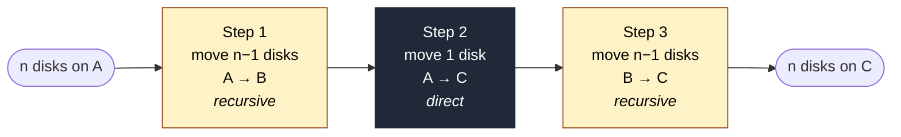
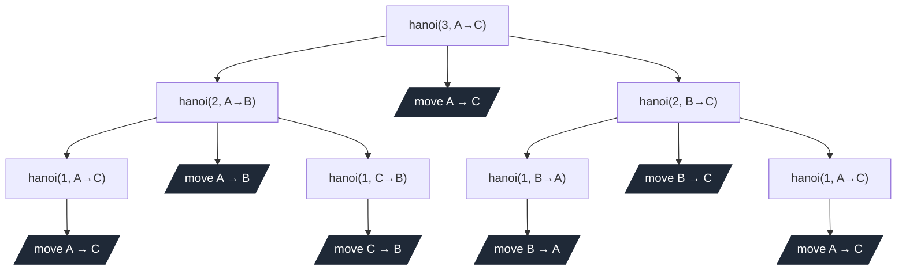

# Tower of Hanoi

A short Python script that solves the Tower of Hanoi puzzle and animates the
solution in your terminal. Built as the demo for the **Broadening the RISC-V
High Precision Code Base and Reach** coding challenge.

No dependencies. No frameworks. No cross-compilation toolchain. If a machine
has Python 3 on it, this runs.

---

## What it looks like

```
  Tower of Hanoi  •  5 disks  •  move  17

         │              │              │
         │              │              │
        ███             │              │
       █████            │           ███████
      ███████          ███         █████████
     █████████        █████       ███████████
  ═══════════    ═══════════    ═══════════
        A              B              C
```

A frame mid-solve. The animation runs around three frames per second — fast
enough to feel responsive, slow enough to actually watch the disks move.

---

## Running it

```bash
python3 hanoi.py          # 5 disks — the default, ~11 seconds
python3 hanoi.py 3        # 3 disks for a quick look
python3 hanoi.py 8        # 8 disks if you want to watch for a while (255 moves)
```

The script caps at 10 disks. That's not a Python limitation — 10 disks is
1023 moves at ~0.35s each, which is six straight minutes of staring at a
terminal. Past that, the demo stops being a demo.

`Ctrl+C` bails out cleanly at any point.

---

## The interesting part

Tower of Hanoi is the textbook example of recursion for a reason: the whole
algorithm fits in three lines and rests on a single observation.

> **If you can move *n − 1* disks somewhere out of the way, you can move *n*
> disks anywhere.**

That sentence is doing a lot of work. To move *n* disks from **A** to **C**,
using **B** as a workspace:



Step 2 is the only real move. Steps 1 and 3 are the same problem at a smaller
scale, which is the cue to recurse. The base case is *n = 0* — nothing to do,
return immediately.

### What the recursion actually does

For 3 disks, the full call tree looks like this:



Every dark node is a real disk-on-pole move. Count them — seven. That matches
`2³ − 1`, which is the optimal solution and not a coincidence; it falls right
out of the recurrence:

```
T(n) = 2·T(n−1) + 1        with        T(0) = 0
```

Two recursive subproblems plus one direct move, all the way down.

---

## Recursion vs. iteration in the source

Both are clearly labelled in `hanoi.py`:

| Section | Where | What it does |
|---|---|---|
| **Recursion** | `hanoi()` | The three-line solver. The whole algorithm. |
| **Iteration** | `for` loop in `main()` | Builds the starting stack by pushing disks largest-first onto tower A. |

A loop is the right tool for setting up the initial state. Recursion would be
theatre. The script keeps them next to each other on purpose — the contrast
makes both easier to read.

Both blocks are wrapped in banner comments (`# RECURSION` / `# ITERATION`) so
they're easy to spot when skimming.

---

## Why Python

Three reasons, ordered by how much they matter:

1. **Zero dependencies.** Just `os`, `sys`, and `time` from the standard
   library. No pip, no venv, no `requirements.txt`.
2. **It runs anywhere Python 3 does** — including every Linux distro that's
   been ported to RISC-V. No cross-compile, no toolchain juggling.
3. **The recursion is unambiguous.** Python's syntax doesn't get in the way
   of the algorithm; the three recursive lines look like the textbook
   description because they basically *are* the textbook description.

The graphics are three Unicode characters: `█` for disks, `│` for poles,
`═` for bases. Any modern terminal handles them.

---

## Files

```
hanoi.py        the entire program (~80 lines, commented)
README.md       this file
```

That's deliberately the whole repo. It's a demo, not a product.

---

## License

MIT. Use it, fork it, port it to RISC-V assembly if you're feeling adventurous.
